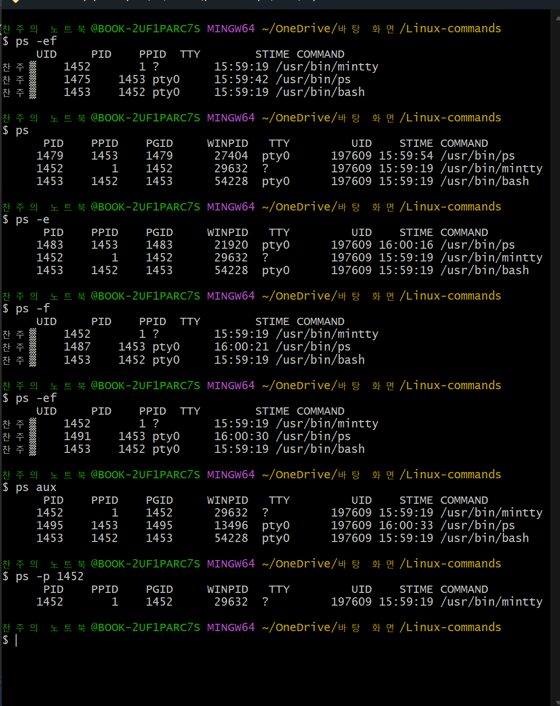
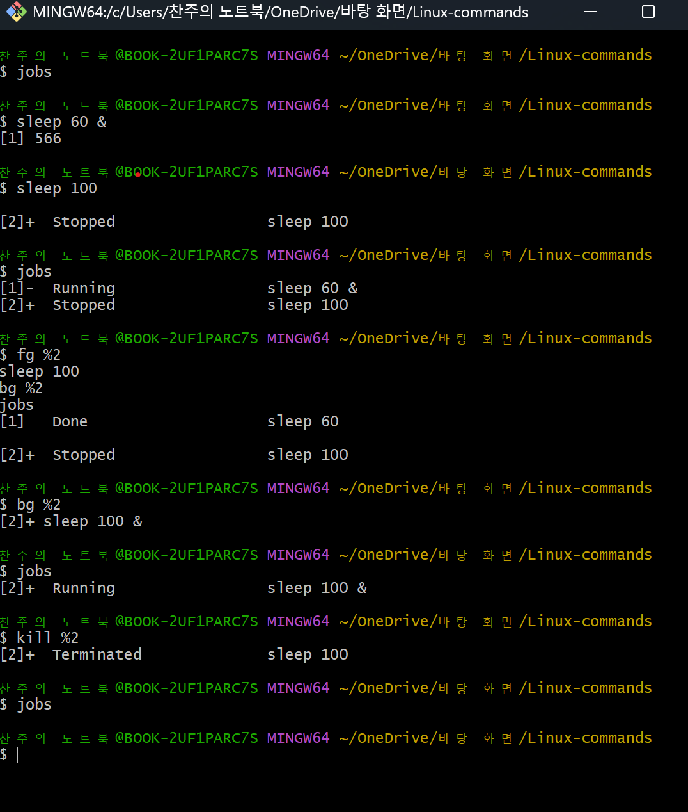

명령어 정리
top

개요: 리눅스 환경에서 실시간으로 시스템의 사용 현황을 모니터링 할 수 있는 도구.
사용 상황
시스템 과부화 원인 분석
- 어느 프로세스가 CPU를 많이 쓰는지
- 어떤 작업이 메모리를 많이 점유하고 있는지
- 시스템이 어떤 상태에 있는지  
-> 문제가 되는 프로세스를 파악하고, 조치할 수 있음.

기본 사용법  
top -> 실시간 프로세스 정보를 출력, 약 3초마다 화면 갱신, q를 눌러 종료 가능.  

유용한 키 조작  
q- 종료  
k- 특정 프로세스를 종료  
r- 특정 프로세스의 우선순위 변경  
P- CPU사용량 기준으로 정렬  
M- 메모리 사용량 기준 정렬  
T- 실행 시간 기준 정렬  
u- 특정 사용자 필터링  
1- CPU 코어별 사용량 보기  
h 또는 ?- 도움말 출력  
f- 열 표시/숨김 설정  
W- 설정 저장  

옵션 정리  
-n 반복 횟수 지정  top -n w  w번 출력하고 종료  
-b 배치 모드 top -b -n w > 파일  
-u 사용자 필터링 top -u 사용자명  
-p PID 필터링 top -p PID  
-d 출력 간격 조정 top -d w w초마다 갱신  
-H 쓰레드 단위 출력 top -H  
  

Git Bash는 사용 불가능.  
  

ps  
개요: ps는 process status로, 현재 시스템에서 실행 중인 프로세스의 상태를 출력해주는 명령어.  
활용: 시스템 자원 분석, 프로세스 모니터링, 디버깅  
  
사용법 및 옵션  
ps 현재 쉘에서 실행 중인 프로세스 출력  
ps -e 또는 -A 시스템 전체 프로세스 출력  
ps -f 전체 형식으로 출력  
ps -ef 전체 프로세스를 전체 형식으로 출력  
ps aux 일부환경에서 BSD 스타일 전체 프로세스 출력  
ps -u 사용자명 해당 사용자의 프로세스만 출력  
ps -p PID 특정 PID의 프로세스 출력  
  
  

jobs  

개요: 현재 셀에서 백그라운드로 실행 중인 작업들의 상태를 확인할 수 있는 명령어.  
일반적으로 &기호를 이용해서 명령어를 백그라운드로 실행한 경우, 해당 작업의 상태를 확인할 수 있다.  

  
명령어 및 흐름 설명  
1. sleep 60 &를 통해 백그라운드 작업 1 생성 (60초 대기, 시간 지나면 자동 종료)  
2. sleep 100 후 컨트롤 z 로 작업 2번 생성 및 중지  
3. jobs 명령어 사용으로 현재 작업 상태 확인   
4. fg %2 로 작업 2를 포그라운드로 재개  
5. 컨트롤 z로 다시 중지, bg %2로 백그라운드에서 재개  
6. kill %2로 작업 2를 강제 종료  
7. 모두 종료된 상태임을 jobs 명령어를 사용해 확인  

명령어 정리  
jobs - 현재 셀에서 실행 중인 백그라운드 및 중지된 작업 확인  
컨트롤 z - 실행 중인 작업을 중지(Stopped 상태로 전환)  
fg %n - 중지된 작업을 포그라운드에서 재개(n: 작업 번호)  
bg %n - 중지된 작업을 백그라운드에서 재개  
kill %n - 해당 작업 종료  

kill 명령어  
실행중인 프로세스나 작업을 종료할 때 사용한다.  
프로세스 ID(PID)나 jobs 명령어의 작업 번호를 사용하여 대상 지정이 가능하다.  

ex  
kill %2 작업 번호 2번 종료  
kill 12345 PID가 12345인 프로세스 종료  
